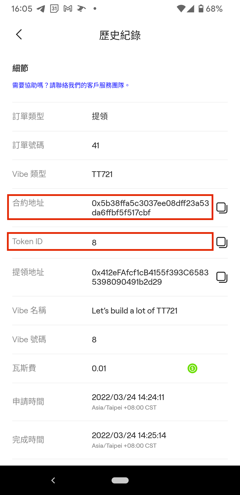
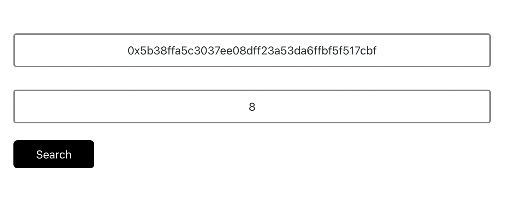
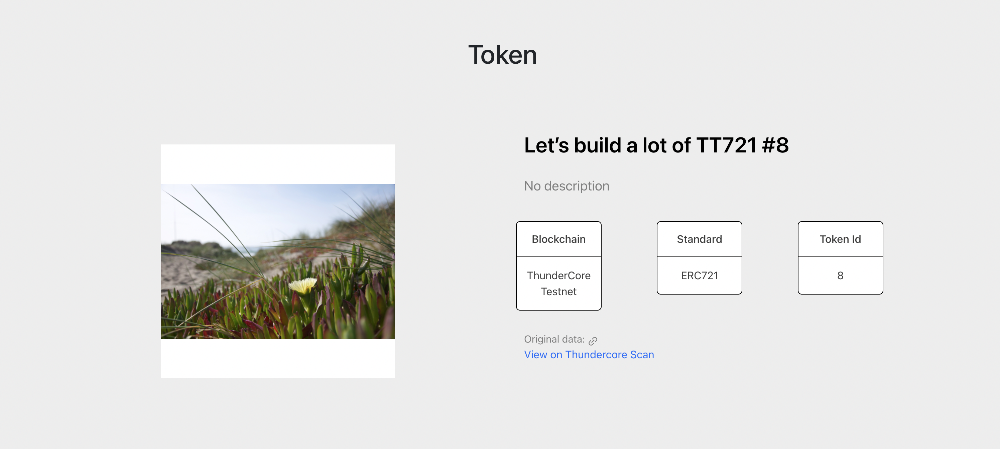
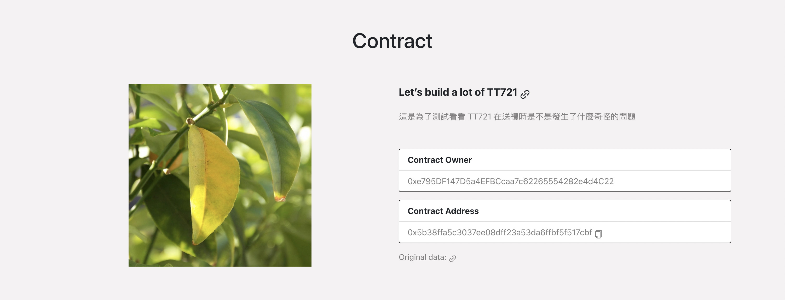
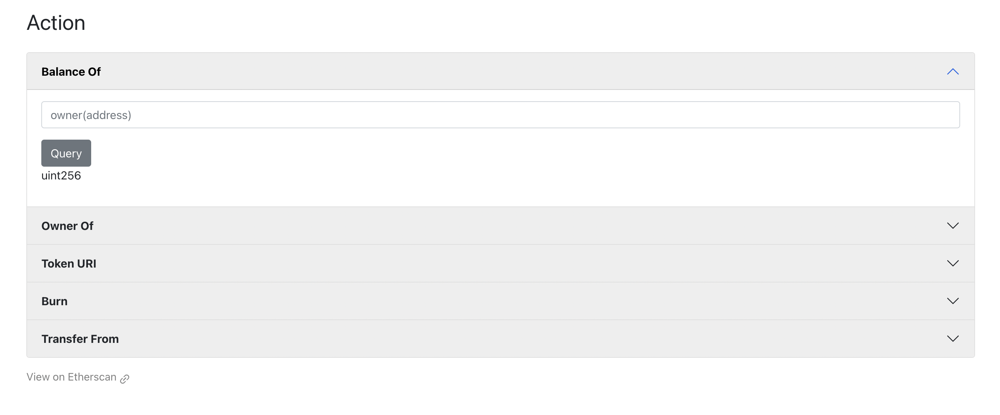

# OurSong NFT-DApp Viewer

A NFT Viewer which allows users to see, search for, do some actions to their NFT.

## Project Introduction
It is difficult to reward NFTs after they are withdrawn, especially BSC's and ThunderCore's NFT. It lacks a simple and convenient way to check your own NFT after withdrawing it.

This project is expected to complete the main functional part of the DApp: view the NFT according to the Contract address and Token ID. In the case of a linked wallet, the number of possessions can be displayed together, and some basic contract operations can be performed, such as balanceOf, transfer, burn, etc.

## Environment and Installation
Clone the project repository first.
```
git clone git@github.com:OurHappy/NFT-DApp.git
```
In the project directory, run the command below and open http://localhost:3000 to view NFT Viewer in your browser.
```
npm start
```

## Steps
After the users withdraw the NFT, they use the known information to check what the NFT looks like, or do other actions.


<!--  -->

The users can search the contract address and the token ID on OurSong NFT Viewer.



Then, the users can see the token information and contract information. They can see more details with the links. Also, the users can connect to their MetaMask wallet by pressing the connect button in the top right corner.

token panel:



contract panel:



At the bottom of the page, the users can do some actions. For example, check the balace of the account, check the owner of the NFT, etc.



Project Contributer: Fish Chan, Jerry Lin, Angela Hsi